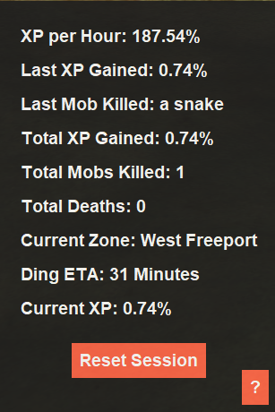
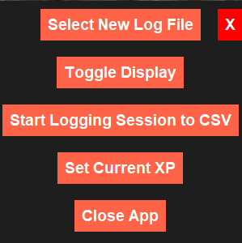
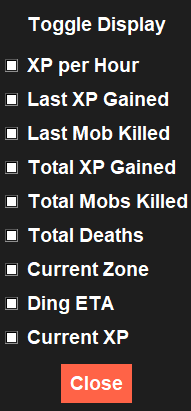

# EQ XP Logger

EQ XP Logger is a Python application that monitors and logs various in-game events from EverQuest logs. It displays real-time information about your gameplay, including experience points (XP) gained, mobs killed, deaths, and zone changes. The application also allows logging these events into a CSV file for later analysis.




## Features

- **Real-time Monitoring**: Tracks and displays XP gained, mobs killed, deaths, and zone changes in real-time.
- **Session Logging**: Logs events into a CSV file for later analysis.
- **Customizable Display**: Toggle display preferences for various statistics.
- **GUI with Tkinter**: Interactive GUI for ease of use.
- **Time to Next Level**: Calculates and displays the estimated time to reach the next level based on current XP gain rate.
- **Current XP Percentage**: Displays the current XP percentage based on user input and XP gained.

## Requirements

- Python 3.x
- tkinter
- pillow (PIL)

## Installation

1. Clone the repository:
    ```bash
    git clone https://github.com/nullservices/eq-xp-parser.git
    cd eq-xp-parser
    ```

2. Install the required Python packages:
    ```bash
    pip install pillow
    ```

## Usage

1. Run the script:
    ```bash
    python eqxpparser.pyw
    ```

2. The application will prompt you to select your EverQuest log file if not already set.
3. Use the GUI to start/stop logging, view statistics, and customize the display.

## Configuration

The application uses a `config.json` file to store the path of the log file and other preferences. This file is created automatically upon first use.

## GUI Components

- **XP per Hour**: Displays the XP gained per hour.
- **Last XP Gained**: Shows the XP gained from the last event.
- **Last Mob Killed**: Displays the name of the last mob killed.
- **Total XP Gained**: Shows the total XP gained during the session.
- **Total Mobs Killed**: Displays the total number of mobs killed.
- **Total Deaths**: Shows the total number of deaths.
- **Current Zone**: Displays the current zone.
- **Ding ETA**: Displays the estimated time to reach the next level.
- **Current XP**: Displays the current XP percentage.
- **Reset Session**: Resets all counters and statistics.
- **Help Button (? Icon)**: Opens a help popup with options to select a new log file, toggle display preferences, set current XP, start/stop logging, and close the application.

## Development

### Regular Expressions

The script uses the following regular expressions to match log entries:

- `xp_gain_pattern`: Matches XP gain events.
- `kill_pattern`: Matches mob kill events.
- `death_pattern`: Matches death events.
- `zone_pattern`: Matches zone change events.

### Logging

Events are logged into a CSV file with the following columns:

- `Type`: The type of event (Kill, Death, Zone).
- `Timestamp`: The timestamp of the event.
- `Zone`: The zone where the event occurred.
- `XP Gain`: The XP gained from the event.
- `Mob Killed`: The name of the mob killed.

### GUI

The GUI is built using Tkinter and includes labels, buttons, and custom styling. The window is transparent, always on top, and draggable.

### Functions

- `load_config()`: Loads the configuration from `config.json`.
- `save_config(config)`: Saves the configuration to `config.json`.
- `select_log_file()`: Opens a file dialog to select the log file.
- `initialize_log_file()`: Initializes the log file path.
- `extract_character_and_server_names(log_file_path)`: Extracts character and server names from the log file name.
- `generate_log_filename()`: Generates a CSV log filename.
- `start_session_log()`: Starts the session log by opening a CSV file in append mode.
- `close_session_log()`: Closes the session log.
- `toggle_logging()`: Toggles the logging state and updates the GUI.
- `restore_logging_state()`: Restores the logging state from the configuration.
- `monitor_log_file()`: Monitors the log file for events and updates the GUI.
- `update_gui()`: Updates the GUI with the latest statistics.
- `reset_counters()`: Resets all counters and statistics.
- `start_monitoring()`: Starts the log file monitoring in a separate thread.
- `open_help_popup()`: Opens the help popup with various options.
- `open_view_popup(parent)`: Opens the view popup for toggling display preferences.
- `set_current_xp()`: Sets the current XP percentage based on user input.
- `update_display_preference(key, var)`: Updates the display preferences and GUI.
- `change_log_file()`: Changes the log file path.
- `start_move(event)`, `stop_move(event)`, `on_motion(event)`: Functions for moving the window.
- `initialize_current_zone()`: Initializes the current zone by looking back through the log file.

## License

This project is licensed under the MIT License.

## Author

Created by well_below_average
